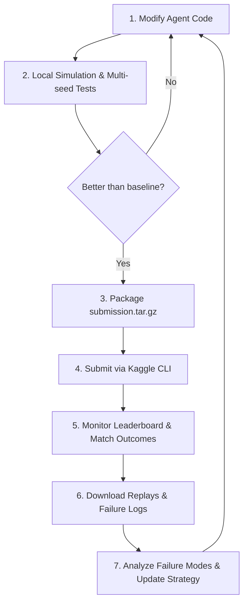
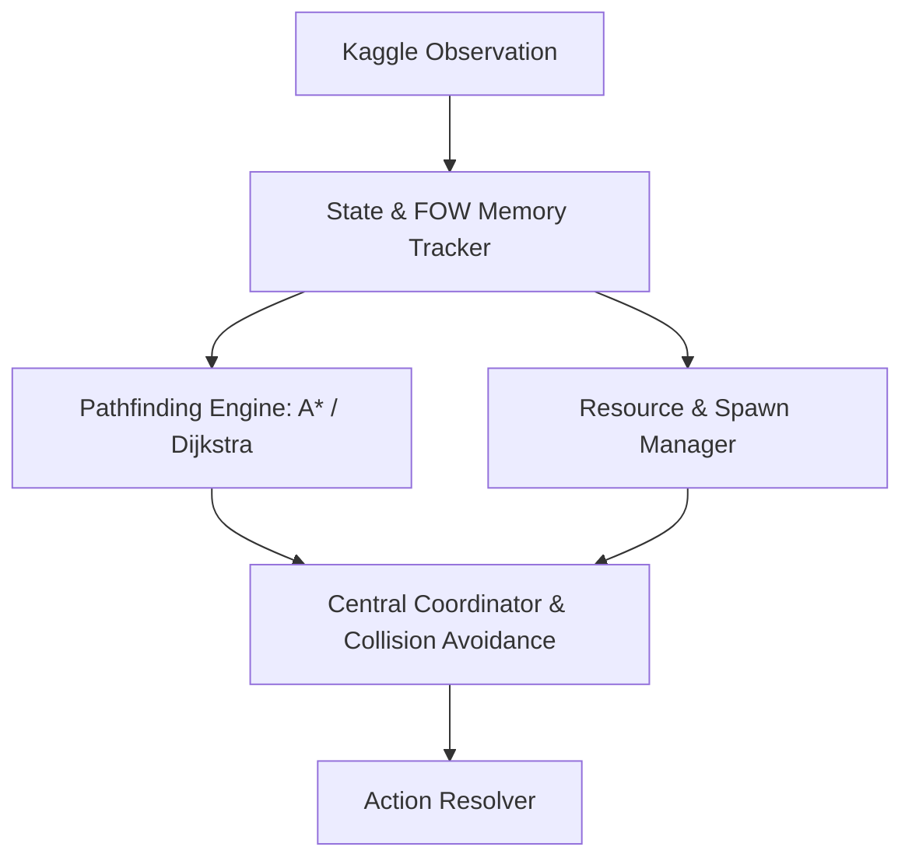

# Maze Crawler (Crawl) Competition Strategy & Workflow

This document outlines a professional development pipeline, system architecture, and an iterative to-do list for the **Maze Crawler (Crawl)** Kaggle competition. It is based on the game rules in [README.md](file:///home/ntdat2428kskh/Documents/MazeCrawler/MazeCrawler/data/README.md) and submission guidelines in [AGENTS.md](file:///home/ntdat2428kskh/Documents/MazeCrawler/MazeCrawler/data/AGENTS.md).

---

## 🎮 Game Rules Summary & Key Mechanics

Understanding the constraints and opportunities is essential for formulating a winning strategy:

*   **Fog of War (FOW):** You only see what your active robots see. Permanent features (walls, mine locations) are remembered once discovered, while transient features (crystals, enemy robots, mining nodes) are only visible within active vision range.
*   **The Scrolling Board:** The southern boundary scrolls north, destroying everything left behind. At step 400+, the scroll speed ramps to **1 cell per turn**. Your Factory *must* stay ahead of the boundary.
*   **Friendly Fire & Crush Combat:** Multiple robots on the same cell trigger crush combat. **Factory > Miner > Worker > Scout**. Same-type collisions destroy *both* units (friendly fire applies). A robust Collision Avoidance System is a high priority.
*   **The Energy Economy:** All robots consume 1 energy per turn. 0 energy forces idle. Total energy is the primary tiebreaker at step 500, and is used for mid-game score rewards.
    *   **Crystals (Harvesting):** Worth 10–50 energy. High density (6%).
    *   **Mines (Production):** Created by Miner `TRANSFORM` on a node. Costs 100 energy. Generates 50 energy/turn up to 1000 max. Unlocked once discovered, and can be shared.

---

## 🔄 Development Pipeline & Workflow

To efficiently iterate on agent strategies, we will adopt a closed-loop engineering workflow:



### Key Workflow Commands (Kaggle CLI)

*   **Local Test:**
    ```bash
    python data/test.py
    ```
*   **Submit Single File:**
    ```bash
    kaggle competitions submit maze-crawler -f main.py -m "Description of changes"
    ```
*   **Submit Multi-file Tarball:**
    ```bash
    tar -czf submission.tar.gz main.py helper.py
    kaggle competitions submit maze-crawler -f submission.tar.gz -m "Multi-file description"
    ```
*   **Monitor Submissions:**
    ```bash
    kaggle competitions submissions maze-crawler
    ```
*   **Download Failures:**
    ```bash
    kaggle competitions replay <EPISODE_ID> -p ./replays
    kaggle competitions logs <EPISODE_ID> 0 -p ./logs
    ```

---

## 🏛️ Proposed Agent System Architecture

A modular agent design prevents spaghetti code and makes debugging much simpler.



### Module Descriptions

1.  **State & FOW Memory Tracker:** Keeps a persistent grid map. Records discovered walls and mines. Tracks active own/enemy units and their energy/cooldown status.
2.  **Resource & Spawn Manager:** Decides when the Factory should spawn Scouts, Workers, or Miners based on energy budgets, cooldowns, and active unit ratios.
3.  **Pathfinding Engine (A*):** Computes paths through the discovered/undiscovered maze.
    *   > [!IMPORTANT]
        > **Scrolling-Safety Cost:** The pathfinder should heavily penalize paths that lag close to the southern boundary, especially as turn numbers approach 400.
4.  **Collision Avoidance System (CAS):** Maps intended destinations for all friendly robots. If two units intend to land on the same square, the coordinator resolves the conflict to prevent mutual friendly destruction.
5.  **Action Resolver:** Translates the coordinated paths and commands into valid action strings.

---

## 📋 Competition To-Do List

Here is an iterative checklist to take the agent from the simple baseline to a high-ranking competitor:

### Phase 1: Local Setup & Evaluation Harness 🛠️
- [ ] **Verify Kaggle API Credentials:** Check that `~/.kaggle/access_token` or environmental keys are working.
- [ ] **Establish Local Evaluation Script:** Write a python script to run 20–50 games with different random seeds against the baseline/random agent and calculate win rates.
- [ ] **Write Automated Packaging Script:** Create a simple shell or python script to automatically zip/tar your source files and submit them to Kaggle.

### Phase 2: Grid Mapping & Pathfinding Foundation 🧭
- [ ] **Create a Persistent Map Tracker:** Integrate a class that tracks wall discoveries permanently in a global grid representation.
- [ ] **Implement A\* Pathfinding:** Create a standard A* search algorithm that respects walls (bitfields) and can route to arbitrary coordinate targets.
- [ ] **Design Scrolling Boundary Safety:** Incorporate a distance-to-south-bound penalty into the A* pathfinder to pull units north before the boundary advances.

### Phase 3: Energy Collection & Scouting (V1 Agent) 💎
- [ ] **Implement Scout Exploration Logic:** When a Scout has no immediate target, make it explore unknown/foggy tiles to map the maze.
- [ ] **Target Crystals:** If a Scout or other unit sees a crystal, route to harvest it.
- [ ] **Energy Return Loop:** If a Scout's energy is high, route it back to the Factory or another energy-hungry unit and perform a `TRANSFER`.

### Phase 4: Mining Economy & Unit Spawning (V2 Agent) ⛏️
- [ ] **Define Factory Spawning Policy:** Implement logic deciding *what* to build next based on current team composition (e.g., maintain 1 Scout, 1 Worker, and up to 2 Miners).
- [ ] **Establish Mining Operations:**
    - Detect visible mining nodes.
    - Path Miners to the nodes and command them to `TRANSFORM` (costs 100 energy).
    - Establish a shuttle system: Send Scouts to harvest energy from active mines and carry it back to fuel the Factory.

### Phase 5: Collision Avoidance & Advanced Tactics (V3 Agent) 🛡️
- [ ] **Implement Collision Avoidance System (CAS):** Prevent friendly-fire by ensuring no two friendly robots schedule paths ending in the same coordinate. If a collision is predicted, force the weaker/non-essential unit to take an alternate path or `IDLE`.
- [ ] **Implement Defensive Jumps:** Teach the Factory to use `JUMP_NORTH/SOUTH/EAST/WEST` when it is trapped by walls or about to be consumed by the southern boundary.
- [ ] **Worker Obstacle Clearance:** Workers should path ahead of the Factory/Miners and use `REMOVE_DIR` to clear blocking walls.

### Phase 6: Aggressive & Strategic Gameplay (V4 Agent) ⚔️
- [ ] **Worker Wall-Traps:** If the opponent factory's trajectory is predictable, use Workers to build walls (`BUILD_DIR`) and trap the enemy factory, causing it to scroll off the board.
- [ ] **Aggressive Miner/Scout Crushing:** If an enemy Scout is on a tile, and we have a Worker or Miner adjacent, use crush mechanics to eliminate the enemy scout.
- [ ] **Factory Combat Blocking:** Block enemy movements using our indestructible Factory.

---

> [!TIP]
> Keep the codebase modular. Put pathfinding, map tracking, and state managers into separate helper files (e.g., `map.py`, `pathfinder.py`) and bundle them into a `tar.gz` for submission. This keeps `main.py` clean and readable!